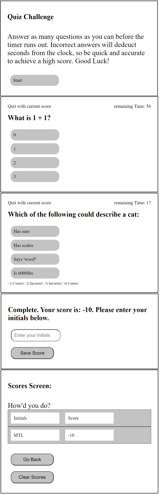

#TimedMathQuiz

## Description

This website contains a timed math quiz that allows users to test their math skills under the pressure of a clock. A score is calculated upon completion, and users' initials and scores are saved to local storage for viewing. 

[Link to application](https://leex3683.github.io/TimedMathQuiz)

## Installation

N/A

## Usage

Upon first loading up the quiz, users are greeted with a explanation of the rules. If "start" in clicked, the quiz begins. A timer will populate in the upper right hand corner of the screen, and a first question will generate.  Incorrect answers will deduct time from the clock, so the user must balance speed and accuracy to get the highest score.

When clicking an answer, users are given feedback at the bottom of the screen indicating whether their answer was correct or incorrect.

After the last question, the user is offered the opportunity to enter their initials. Once submitted, they are taken to a score screen, where initials and scores from local storage are saved (until cleared with the "clear scores" button.)

## Credits

N/A

## License

N/A

## Badges

N/A

## Features

N/A

## How to Contribute

N/A

## Tests

N/A